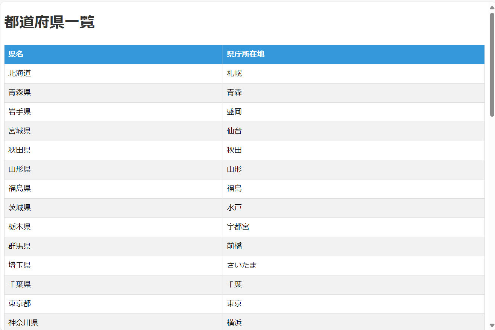
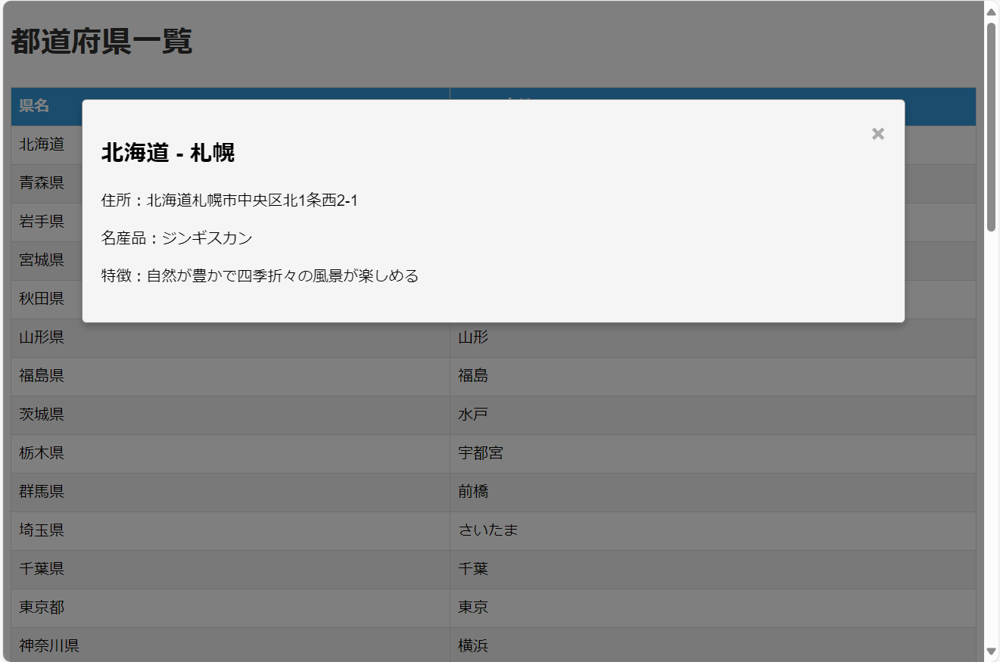

# Project Overview

This project is implemented using Service Worker functionality and provides information about prefectures in Japan. It includes a list of prefectures and their capitals, as well as detailed information about the capital city of each prefecture.

## Features

### Service Worker

The project utilizes Service Worker to implement offline functionality. Once the Service Worker is registered, the application can be accessed even when the user is offline. This enhances user experience by providing seamless access to information regardless of network availability.

### Prefecture List Page

The project includes a page that displays a list of all prefectures in Japan along with their capital cities. Users can click on any prefecture in the list to view detailed information about its capital city in a modal window.

## How to Use

1. Clone the repository to your local machine.
2. Open the `index.html` file in a web browser.
3. Explore the list of prefectures and their capital cities.
4. Click on a prefecture to view detailed information about its capital city in a modal window.

## Technologies Used

- HTML
- CSS
- JavaScript

## Contributions

Contributions to improve the project are welcome! Please feel free to open an issue or submit a pull request with your suggestions or enhancements.

## License

This project is licensed under the [MIT License](LICENSE).
